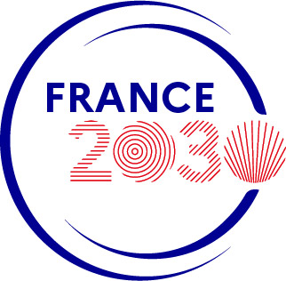

# converter-ecg

A collection of Go modules for converting ECG binary formats to and from FDA-compliant HL7 v3 aECG XML, using the [hl7v3-aecg](https://github.com/LIRYC-IHU/hl7v3-aecg) library.

## Overview

Medical ECG data exists in a variety of proprietary and standard binary formats. This project provides standalone converters to produce (or consume) FDA-compliant HL7 v3 Annotated ECG (aECG) XML files, as required for clinical trial submissions.

Each converter lives in its own directory and can be used independently.

## Converters

| Converter           | Source format         | Target format         | Status |
| ------------------- | --------------------- | --------------------- | ------ |
| `nk-to-fda`         | NK .DAT (PEC format)  | FDA HL7 v3 aECG XML   | Done   |
| `nk-to-dicom`       | NK .DAT (PEC format)  | DICOM (ECG waveforms) | Done   |
| `dicom-to-fda`      | DICOM (ECG waveforms) | FDA HL7 v3 aECG XML   | Done   |
| `fda-to-dicom`      | FDA HL7 v3 aECG XML   | DICOM (ECG waveforms) | Done   |
| `philipsXml-to-fda` | Philips ECG XML       | FDA HL7 v3 aECG XML   | Done   |
| `mindray-to-fda`    | BeneHeart R12 .PAT    | FDA HL7 v3 aECG XML   | Done   |
| `mindray-to-dicom`  | BeneHeart R12 .PAT    | DICOM (ECG waveforms) | Done   |

## PDF Reports

Beyond format conversion, the toolkit renders printable **12-lead ECG PDF reports**
(NK paper style): vector waveform traces on a scale-calibrated red grid,
selectable-text metadata, fillable form fields, and a physician-diagnosis block.

| Tool             | Source                | How it works                      |
| ---------------- | --------------------- | --------------------------------- |
| `fda-to-pdf`     | FDA HL7 v3 aECG XML   | Universal renderer                |
| `nk-to-pdf`      | NK .DAT (PEC)         | Direct (keeps NK-specific fields) |
| `philips-to-pdf` | Philips SierraECG XML | Wrapper: Philips → FDA → PDF      |
| `muse-to-pdf`    | GE MUSE XML           | Wrapper: MUSE → FDA → PDF         |
| `mindray-to-pdf` | BeneHeart R12 .PAT    | Wrapper: Mindray → FDA → PDF      |

Every non-NK vendor converts to FDA aECG first, then the shared renderer turns the
FDA document into a PDF — a single code path (`ecgpdf` + `fdapdf`) serves all of
them. NK keeps a direct path to preserve fields FDA does not carry (RV5/SV1
amplitudes, medications, clinical history, …).

### Features

- **Vector traces** — polylines on a calibrated grid (28 mm/s · 12 mm/mV); zoom
  without pixelation. Each major grid square stays 0.2 s / 0.5 mV.
- **Selectable text** — all metadata is real text, not a rasterized image.
- **Fillable forms** — patient and measurement values are pre-filled AcroForm
  fields (blank when unknown); a clinician can complete/correct and sign in any
  PDF viewer. Disable with `-forms=false`.
- **Physician-diagnosis block** — editable free-text area + Physician/Date line,
  below the interpretation.
- **Bilingual** — `-l en` (default) or `-l fr`.

### Usage

```bash
# Write a PDF file
fda-to-pdf      -i ecg_fda.xml -o report.pdf
nk-to-pdf       -i ecg.DAT     -o report.pdf
philips-to-pdf  -i ecg.xml     -o report.pdf -l fr

# No -o → base64-encoded PDF on stdout (for piping to external tools)
philips-to-pdf -i ecg.xml | base64 -d > report.pdf
```

## Project Structure

```
converter-fda/
├── nk-to-fda/          # NK .DAT (PEC) → FDA HL7 v3 aECG XML
├── nk-to-dicom/        # NK .DAT (PEC) → DICOM ECG
├── dicom-to-fda/       # DICOM → FDA HL7 v3 aECG XML
├── fda-to-dicom/       # FDA HL7 v3 aECG XML → DICOM (also hosts ParseFDA)
├── philips-to-fda/     # Philips XML → FDA HL7 v3 aECG XML
├── philips-to-dicom/   # Philips XML → DICOM ECG
├── mindray-to-fda/     # Mindray .PAT → FDA HL7 v3 aECG XML
├── mindray-to-dicom/   # Mindray .PAT → DICOM ECG
├── muse-to-fda/        # GE MUSE XML → FDA HL7 v3 aECG XML
├── ecgpdf/             # Shared vendor-neutral PDF renderer (Report → PDF)
├── fdapdf/             # FDA aECG XML → ecgpdf.Report mapper
├── cmd/                # CLI entrypoints (*-to-fda, *-to-dicom, *-to-pdf)
└── go.mod
```

<!-- CLI_TOOLS_START -->
## CLI Tools

- `dicom-to-fda` 
```bash
go install github.com/LIRYC-IHU/ecg-bridge/cmd/dicom-to-fda@latest
```

- `fda-to-dicom` 
```bash
go install github.com/LIRYC-IHU/ecg-bridge/cmd/fda-to-dicom@latest
```

- `fda-to-pdf` 
```bash
go install github.com/LIRYC-IHU/ecg-bridge/cmd/fda-to-pdf@latest
```

- `mindray-to-dicom` 
```bash
go install github.com/LIRYC-IHU/ecg-bridge/cmd/mindray-to-dicom@latest
```

- `mindray-to-fda` 
```bash
go install github.com/LIRYC-IHU/ecg-bridge/cmd/mindray-to-fda@latest
```

- `mindray-to-pdf` 
```bash
go install github.com/LIRYC-IHU/ecg-bridge/cmd/mindray-to-pdf@latest
```

- `muse-to-dicom` 
```bash
go install github.com/LIRYC-IHU/ecg-bridge/cmd/muse-to-dicom@latest
```

- `muse-to-fda` 
```bash
go install github.com/LIRYC-IHU/ecg-bridge/cmd/muse-to-fda@latest
```

- `muse-to-pdf` 
```bash
go install github.com/LIRYC-IHU/ecg-bridge/cmd/muse-to-pdf@latest
```

- `nk-to-dicom` 
```bash
go install github.com/LIRYC-IHU/ecg-bridge/cmd/nk-to-dicom@latest
```

- `nk-to-fda` 
```bash
go install github.com/LIRYC-IHU/ecg-bridge/cmd/nk-to-fda@latest
```

- `nk-to-pdf` 
```bash
go install github.com/LIRYC-IHU/ecg-bridge/cmd/nk-to-pdf@latest
```

- `philips-to-dicom` 
```bash
go install github.com/LIRYC-IHU/ecg-bridge/cmd/philips-to-dicom@latest
```

- `philips-to-fda` 
```bash
go install github.com/LIRYC-IHU/ecg-bridge/cmd/philips-to-fda@latest
```

- `philips-to-pdf` 
```bash
go install github.com/LIRYC-IHU/ecg-bridge/cmd/philips-to-pdf@latest
```

<!-- CLI_TOOLS_END -->

## Dependencies

- **[hl7v3-aecg](https://github.com/LIRYC-IHU/hl7v3-aecg)** — Go library for generating/parsing FDA-compliant HL7 v3 aECG XML files (12-lead ECG, annotations, clinical trial metadata)
- **[go-pdf/fpdf](https://github.com/go-pdf/fpdf)** — pure-Go PDF generation (vector traces + selectable text) for the PDF reports
- **[pdfcpu](https://github.com/pdfcpu/pdfcpu)** — overlays the fillable AcroForm fields onto the rendered PDF

```bash
go get github.com/LIRYC-IHU/hl7v3-aecg
```

## Requirements

- Go 1.25+

## Funding

<p align="center">
  
  
</p>

This project has been funded by the French government as part of the France 2030
initiative and by the European Union - Next Generation EU as part of the France
Relance plan.

## License

This project is licensed under the **Apache License 2.0** — see the
[LICENSE](LICENSE) file for details.

It depends on [hl7v3-aecg](https://github.com/LIRYC-IHU/hl7v3-aecg), also
developed at IHU LIRYC.
